# Convolutional Neural Networks in Gaussian Blur Deconvolution
Amos Kendall and Juan Rios

## Problem Statement

Image blur is a pervasive problem in image capture. Noise from blurry images decreases the visual appeal of pictures, and makes computer vision algorithms less reliable. The challenge of blur recovery is a classic ill-posed problem, often modeled as

B = K*I + N

Where B is the known blurred image, K is the blur kernel, I is the unknown true image, and N is unknown noise. The challenge is that a method must predict K, I, and N from a given example or set of examples [1].

Fundamentally, there are two different types of blur problems - blind blur and non-blind blur. Blind blur is where the blur kernel, K, is not known a priori. Non-blind blur occurs when the blur kernel is known [2]. Blind blur problems are both more challenging and more common, and will be the focus of this project.

## Background
Blur recovery is important because it can be used with popular consumer products like cameras or phones and can aid other tech and software initiatives. Additionally, deblurring is important in scientific applications. For example, in Astronomy image data of star systems is subject to blurring effects. Undoing these effects is important in creating more accurate results [3]. Another example is the use of delburring in medical imaging such as X-ray, mammographies, and ultrasound images for more accurate medical diagnosis [4].
The classical approach to blind blur problems is to look at a single image and use probability based estimates to predict the true image. Typical methods include Bayesian Inference Frameworks, which find an optimal solution by maximizing a hypothesis based on given evidence. Another popular approach is to use regularization techniques such as Tikhonov-Miller regularization, which attempt to convert ill-posed problems to well-posed problems by constraining the solution space. Other methods include Homography-Based methods, Sparse Representation-Based methods, and Region-Based methods [1].

With advances in computing power and refinement of neural network theory, especially deep, convolutional neural networks (CNN), there have been various attempts to use a collection of blurred images to learn more details of the problem. The key insight is that if some features of image blur are shared between different images, analyzing multiple images gives more information when trying to discover the unknowns, K, I and N. Initial approaches aimed to train a network to learn the blur kernel, K, from synthetic datasets where K would be known, but varied, to allow for a generalized learning of K. Examples include Schuler [5], who iteratively uses CNN to extract features and then estimate the kernel, and Sun [6] who uses a CNN to estimate motion blur vectors.

Recently, there has been more focus on end-to-end networks that take the blurred image, B, as input and attempt to directly produce the true image, I. The advantage of these end-to-end networks is that the learning considers both the kernel estimation on the image recovery in a continuous form, and they do not rely on a known blur kernel. These models can gracefully handle more complicated, spatially varying kernels, and tend to be more robust to noise and saturation [7]. State of the art learning methods use CNNs with additional architecture designed to maximize the learning of shared information between images.  Nah et al train multiple CNNs using different image scales, where a smaller scale network output is also used as input for the next larger scale. Each network is then updated via back propagation. The effect is to learn abstract features of the image while preserving localized information needed to reconstitute the pixels of the true image [7]. Tao et al use a similar method of combining networks of multiple scales, but with added connected recurring long short term memory units in the middle of each network to add more connections between the scales. They also applied a form of encoding and decoding within a single scale to further magnify the learning of both abstract and local features [8]. Zhu et al use generative adversarial networks (GAN) to learn the loss function while also training a network to generate non-blurry images. Their generator network is based on a UNET framework which uses encoding and decoding with layer skipping to combine local and abstract features. The discriminator then learns to examine a collection of local patches to determine if the generated image comes from the ground truth sample or from a generated de-blurred image. The ability to learn the loss function in this way allows for more powerful optimization of the deblurring problem [9].

## Our Approach 

Our goal was to investigate how learning based approaches could be integrated with classical non-learning approaches.

### Phase I

Initially, we focused on a simple setting -  gaussian blur applied uniformly to the entire image. For our initial dataset, we used 25000 images from imagenet [10]. For testing and training, we applied a blur to these images. The gaussian blur standard deviation was drawn randomly from (the absolute value of) a normal distribution with mean 0 and sdv 5. 

To determine a baseline for performance, the Maximum Likelihood algorithm is used for blind deconvolution, and the Richardson-Lucy (RL) algorithm was chosen for non-blind deconvolution. These are standard methods for non-blind and blind deblurring. Both algorithms are based on the Bayesian Inference Frameworks [1].

We also developed two different neural network architectures. The first one takes a blurry image and predicts the blur kernel. Then we use the blur kernel to apply the non-blind RL algorithm. Refer to this method as CNN + RL.

To predict the gaussian blur kernel, we trained a CNN with 3 convolutional layers and 3 fully connected layers. The CNN was given a blurry image as input with a gaussian kernel size as a label.

The second network is an end-to-end network that takes in the blurry image and produces a prediction of the true underlying image. This network is based on UNETs [11] commonly used for pixel segmentation. UNETs are a powerful method to learn a combination of abstract features and local details. They use convolutional layers (often called encoding) to build increasingly abstract feature maps, and then combine upsampling with the already generated less abstract feature maps to decode the learned features into an image. Our UNET architecture used 3 encoding and 3 decoding layers.

### Phase II

In our second phase, we addressed the issue of spatially varying blur. In natural settings, blurs are rarely applied uniformly to an image. Instead the blur is typically local. For example, blur caused by varying depth of field will only be present in the parts of the scene that differ in depth from the plane of focus. 

We used the true vs. blur dataset generated by Nah[7]. This dataset has spatially varying blur, does not contain a known blur kernel, and it is not limited to gaussian blur. To improve training performance, we shrunk each image 5x.

For predicting the blur kernel, we assumed that for a small enough local patch, the blur is constant.Given this assumption, we trained our prediction network to estimate the blur of a synthetically blurred image patch where the blur kernel is known. Then for blur recovery, 

For the end to end network, we were able to use the same architecture as in phase I. However we extended our results by implementing a GAN approach where the generator network was given a blurry image and tried to construct a denoise image. The discriminator network was fed both true sharp images and denoised images from the generator, and tried to distinguish between the two sets. The descriminator’s success was then used as the basis of the loss for both networks. The architecture for the generator was similar to that of the UNET we used, except we added an additional skip layer connection between the blurry input image and the final upsampled layer. This idea was motivated by Resnet architecture, which suggests that learning the difference between the input and output can be easier than learning a function that maps the input to the output [https://arxiv.org/abs/1512.03385]. For the discriminator, we used 6 convolutional layers with leaky relu and batch normalization.

## Results

We compare the performance of our methods using the mean PSNR and SSIM as our evaluation metrics. For each dataset, we used a test set that was unseen by the various learning algorithms.

### Phase I
We compare our non-learning baseline, with the CNN blur kernel estimator + RL, and the End to End Unet based approach. Note that blind deblur takes as input a guessed filter based on 1 sigma, which gives the best blind deblur performance based on our blur kernel distribution.

| Method | PSNR | SSIM |Runtime on testset (s) |
|------|-----|-----| ----- |
|Baseline blind deblur |23.15 | 0.7541| 182.44 |
|CNN + RL |24.18 |0.7669 | 72.19 |
|End to End UNET | 21.58| 0.7526| 781.67 |

The CNN + RL achieved the best results for both SSIM and PSNR in the least amount of time. A 2-tailed t-test resulted in PSNR differences as statistically significant, while SSIM differences as not statistically significant. Nevertheless, the CNN + RL remains the best method for this setting. Additionally, the CNN is substantially better at recovering a kernel than blind deblur. We compare a kernel distance MSE of 0.02 for CNN + RL, to a MSE of 0.07 for blind deblur. 

The performance of the end-to-end network was in line with both blind and CNN + RL methods. Subjectively, we believe it recovers an image that looks less blurry to the human eye especially for large sigma values. This is consistent with some criticism of PSNR as an accurate measure of deblur quality [12].

|Sigma Value |Original Image |Blurry Image |Blind Deblur | CNN + RL deblur |UNET Deblur|
| ---------- | ------------- | ----------- | ----------- | --------------- | --------- |
| 5.2110     | | | | | |
| 0.2615 | | | | | |
| 1.4530 | | | | | |
| 5.8059 | | | | | |

Figure 1 The results of the three deblurring methods performed on 4 images

### Phase II

We used the blurry images as a baseline for SSIM and PSNR. We then compare our CNN + RL + Stitching method to the Simple UNET and the GAN approach. Note that since we resized the images, and the blur was captured in a realistic way that was only present in small areas of the image, the blur to sharp baseline is actually quite high in regard to SSIM and PSNR.

| Method | PNSR | SSIM |Runtime on testset (s) |
|------|-----|-----| ----- |
| Blurry Baseline    | 31.9200  |0.9574    | 0 |
| CNN + RL + Stitching    |  | | |
| UNET | 29.0705   | 0.9531 |2802.63 |
| GAN |24.7497 |0.8800 |947.4906 |

| sharp | blur | CNN + Sticthing | UNET | GAN|
| ---- | ----| ---- | ----| ----|
| | | | | 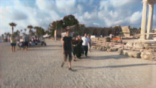|
|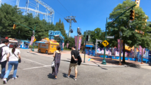 |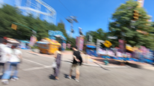 | | 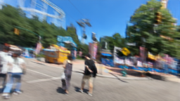| 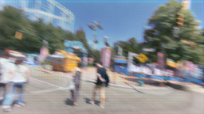|
|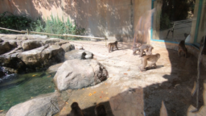 |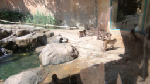 | | 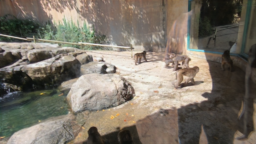| 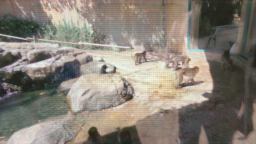|
|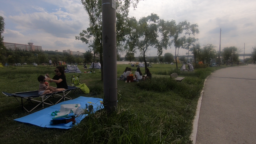 |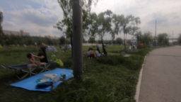 | | 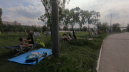| 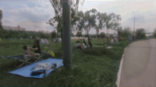|

Figure 2 The results of the three deblurring methods performed on 4 images

The performance achieved by the generator in the GAN network did not achieve better than the traditional UNET structure, but it did provide two interesting results. First, the performance continued to improve with additional training, suggesting that more training time could help close the gap. The table below shows the performance based on the number of training epochs, where each Epoch cycled through all 24000 training images.

| Training Epochs | SSIM | PNSR |
|------|-----|-----|
| 2    | 0.7800  |21.7142    |
| 3    | 0.8011  | 22.8159  |
| 4    | 0.8800   | 24.7497  |

Second, since the GAN generator is trained specifically to fool the GAN discriminator, it tended to produce image artifacts that fooled the discriminator, but did not actually improve the deblur process. We believe that additional training could help the discriminator discriminate between these artifacts and true sharp images.

## Challenges

One challenge in tuning the hyperparameters for the end-to-end network is that the training time on our current hardware is costly. It took 16 hours to train the end-to-end network over 2 iterations of 25,000 images. This time horizon increases the cost of experimenting with different hyperparameters or network architecture.

## Conclusion

## References

[1] <link>https://arxiv.org/pdf/1409.6838.pdf</link>
[2] https://arxiv.org/ftp/arxiv/papers/1710/1710.00620.pdf
[3] https://svs.gsfc.nasa.gov/2796
[4] https://pdfs.semanticscholar.org/6121/aa87089eee8d85109b5a291cd1b39ebd2639.pdf
[5] https://arxiv.org/pdf/1406.7444.pdf
[6] https://arxiv.org/abs/1503.00593
[7] https://arxiv.org/abs/1612.02177
[8] https://arxiv.org/abs/1802.01770
[9] https://arxiv.org/abs/1611.07004
[10] http://www.image-net.org/
[11] https://arxiv.org/abs/1505.04597
[12] https://www.mathworks.com/help/images/image-quality-metrics.html
[13] https://fled.github.io/paper/blur.pdf
